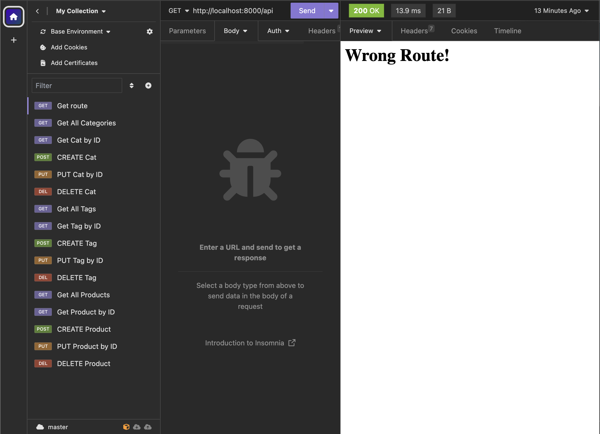

# E-commerce Back End

## Table of Contents

- [Description](#description)
- [Installation](#installation)
- [Usage](#usage)
- [Video](#video)
- [Contributors](#contributors)
- [Questions](#questions)

## Description

A back end for an e-commerce website using Node, Express, Sequelize, and MySQL2. Users can use the CRUD operations for the category, product and tag data.

## Installation

List specific steps to help remove ambiguity and get people to use your project as quickly as possible. Let people know if it only runs in a specific context like a particular programming language version or operating system or has dependencies that have to be installed manually.

1. To install necessary dependencies, run the following command:
   Run the following command to install the dependencies you will need for this repo to work:  
   `npm install`
2. You will need to create a .env file in the root directory and add the following code and replace with the quotes with your mySQL username and password:

   ```
   DB_NAME='ecommerce_db'
   DB_USER='your_mysql_username'
   DB_PW='your_mysql_password'
   ```

3. To create the database and seed it you will need to run:
4. `mysql -u root`
5. `SOURCE db/schema.sql`
6. `quit`
7. `node seeds/index.js`

## Usage

Use this space to show useful examples of how a project can be used. Additional screenshots, code examples and demos work well in this space. You may also link to more resources.

To start this project, run the following command:  
 `npm start`  
 Once you have it running, you can test the API routes in Insomnia or Postman.

## Video
Click the image below to watch a walkthrough tutorial:  
[](https://watch.screencastify.com/v/f1VoAjvyPbHpPviLj4Io)

## Contributors

Show your appreciation to those who have contributed to the project.  
 Also state if you are open to contributions and what your requirements are for accepting them. For people who want to make changes to your project, it's helpful to have some documentation on how to get started.

1. Fork the Project
2. Create your Feature Branch: "git checkout - b feature / featureName"
3. Commit your Changes: "git commit - m 'Add something featureName'"
4. Push to the Branch: "git push origin feature / featureName"
5. Open a Pull Request

## Questions

To view more of my work, visit my GitHub page: [GitHub: maggiemcc](https://github.com/maggiemcc)  
 If you have any questions, please feel free to contact me by email: maggiemccausland@hotmail.com
